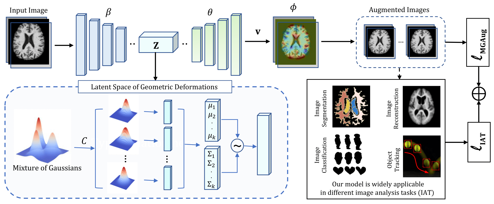

# MGAug: Multimodal Geometric Augmentation in Latent Spaces of Image Deformations

This repository provides the PyTorch implementation of the paper, [MGAug: Multimodal Geometric Augmentation in Latent Spaces of Image Deformations](https://arxiv.org/abs/2312.13440)

## Abstract

Geometric transformations have been widely used to augment the size of training images. Existing methods often assume a unimodal distribution of the underlying transformations between images, which limits their power when data with multimodal distributions occur. In this paper, we propose a novel model, *Multimodal Geometric Augmentation* (MGAug), that for the first time generates augmenting transformations in a multimodal latent space of geometric deformations. To achieve this, we first develop a deep network that embeds the learning of latent geometric spaces of diffeomorphic transformations (a.k.a. diffeomorphisms) in a variational autoencoder (VAE). A mixture of multivariate Gaussians is formulated in the tangent space of diffeomorphisms and serves as a prior to approximate the hidden distribution of image transformations. We then augment the original training dataset by deforming images using randomly sampled transformations from the learned multimodal latent space of VAE. To validate the efficiency of our model, we jointly learn the augmentation strategy with two distinct domain-specific tasks: multi-class classification on 2D synthetic dataset and segmentation on real 3D brain magnetic resonance images (MRIs). We also compare MGAug with state-of-the-art transformation-based image augmentation algorithms. Experimental results show that our proposed approach outperforms all baselines by significantly improved prediction accuracy.



## Setup
* matplotlib
* torch
* torchvision
* SimpleITK
* yaml
* easydict
* numpy
* scikit-learn
* lagomorph

To install the lagomorph, please direct to [https://github.com/jacobhinkle/lagomorph](https://github.com/jacobhinkle/lagomorph)


## Training
For training, please run the *training.py python* file. To easily execute and understand different blocks of the complete network architecture, a jupyter notebook version is also provided. Please refer to the *MGAug.ipynb*.  

## References
This code is only for research purposes and non-commercial use only, and we request you to cite our research paper if you use it:
[MGAug: Multimodal Geometric Augmentation in Latent Spaces of Image Deformations](https://arxiv.org/abs/2312.13440)

```bibtex
@article{hossain2023mgaug,
  title={MGAug: Multimodal Geometric Augmentation in Latent Spaces of Image Deformations},
  author={Hossain, Tonmoy and Zhang, Miaomiao},
  journal={arXiv preprint arXiv:2312.13440},
  year={2023}
}
```
